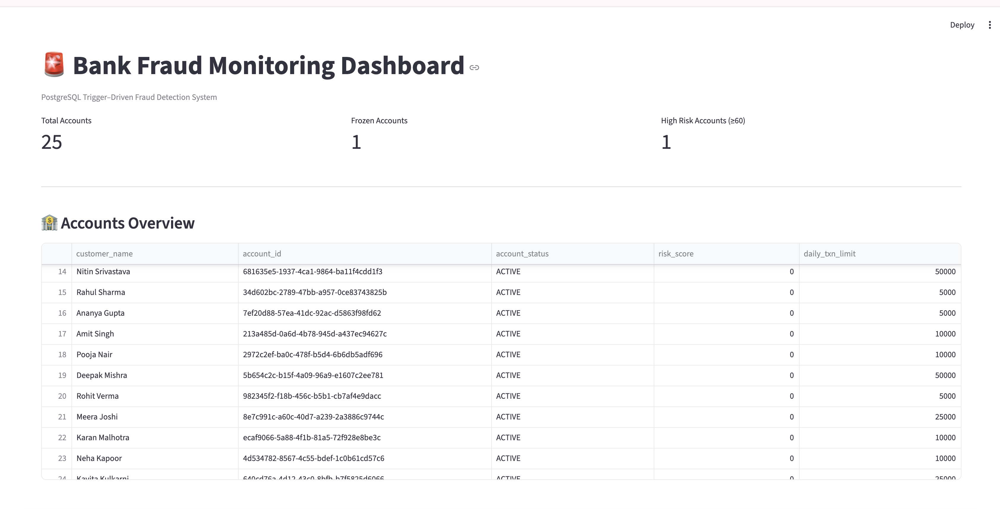
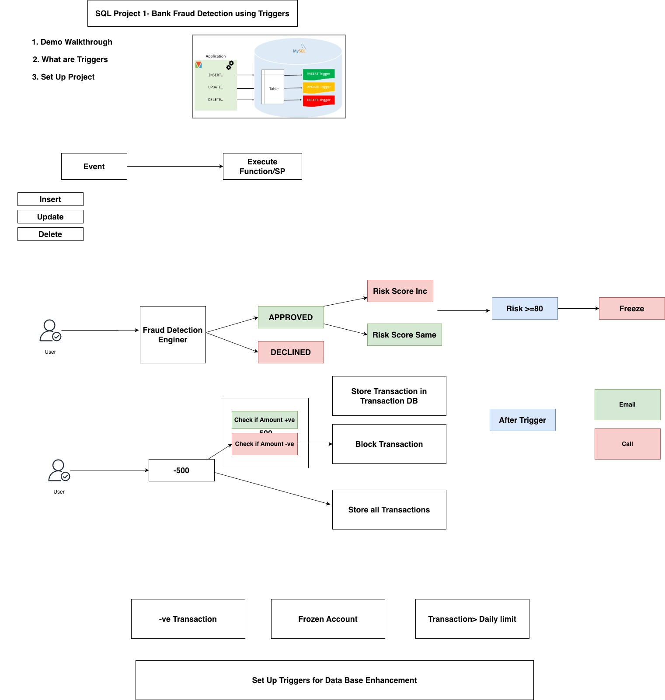
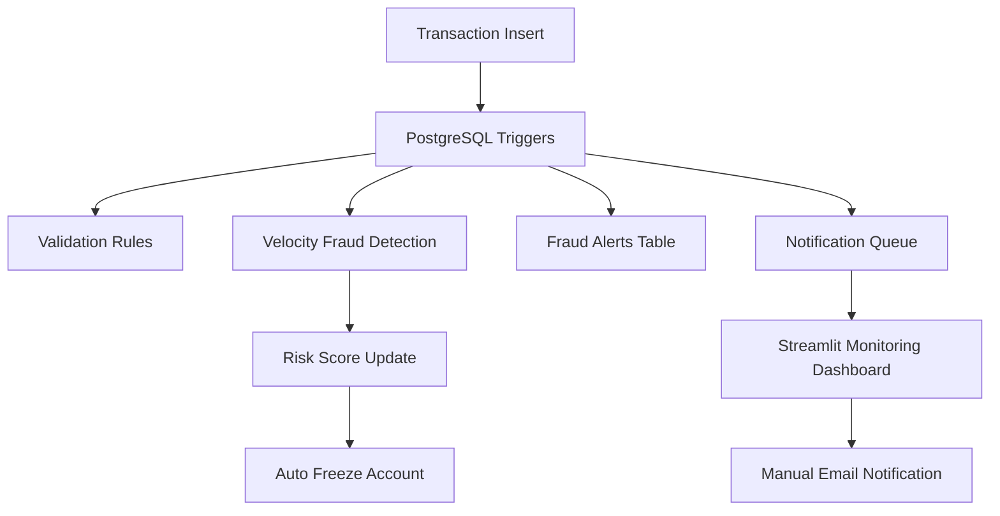

# SQL Project 1: Bank Fraud Detection Using SQL Triggers

## Enterprise-Grade, Event-Driven Fraud Detection System

This project implements a **production-inspired banking fraud detection system** by embedding fraud rules directly into the **PostgreSQL database layer** using **SQL triggers**.

Instead of relying on application-side validations, this system enforces fraud detection, risk scoring, and account control at the **data layer**, ensuring low latency, strong consistency, and auditability across all consuming applications.

---

## 🎥 Demo Video

## 🔍 Problem Statement

In real-world banking systems:

* Millions of transactions occur daily
* Fraud must be detected in near real time
* Application-only checks are fragile and bypassable
* Multiple services often write to the same database

**Objective:**
Design a centralized fraud detection system that works **independently of application logic** and guarantees enforcement at the data source.

---

## Flow 

## 🧠 Design Philosophy

* Database is the **single source of truth**
* Fraud rules must be **deterministic and auditable**
* Detection and enforcement should be **event-driven**
* Monitoring systems must be **read-only**
* Notifications should be **controlled and analyst-driven**

---

## 🏗️ System Architecture

---

## ⚙️ Core Components

### 1. Database Schema (Current State)

The system is built on a small but expressive relational schema. Each table has a **clear responsibility** and mirrors real banking systems.

---

## 🗄️ Table Schemas

🔗 **Download the dataset:**  

https://drive.google.com/file/d/1xdsrpcgjv7Qvx4Thx-pbZV4FFj4llou5/view?usp=sharing

### 📋 `customers`

Stores customer identity (persona layer).

| Column Name | Data Type | Description                |
| ----------- | --------- | -------------------------- |
| customer_id | UUID (PK) | Unique customer identifier |
| full_name   | TEXT      | Customer full name         |
| email       | TEXT      | Contact email              |
| created_at  | TIMESTAMP | Record creation time       |

---

### 🏦 `accounts`

Represents bank accounts and risk posture.

| Column Name     | Data Type | Description               |
| --------------- | --------- | ------------------------- |
| account_id      | UUID (PK) | Unique account identifier |
| customer_id     | UUID (FK) | Linked customer           |
| account_status  | TEXT      | ACTIVE / FROZEN           |
| daily_txn_limit | NUMERIC   | Daily transaction cap     |
| risk_score      | INT       | Accumulated fraud risk    |
| created_at      | TIMESTAMP | Account creation time     |

---

### 💳 `transactions`

Captures all monetary movements.

| Column Name   | Data Type | Description            |
| ------------- | --------- | ---------------------- |
| txn_id        | UUID (PK) | Transaction identifier |
| account_id    | UUID (FK) | Account used           |
| amount        | NUMERIC   | Transaction amount     |
| txn_type      | TEXT      | POS / ATM / TRANSFER   |
| direction     | TEXT      | IN / OUT               |
| source        | TEXT      | Origin of transaction  |
| txn_timestamp | TIMESTAMP | Event time             |

---

### 🚨 `fraud_alerts`

Stores detected fraud signals.

| Column Name   | Data Type   | Description            |
| ------------- | ----------- | ---------------------- |
| alert_id      | SERIAL (PK) | Alert identifier       |
| account_id    | UUID        | Impacted account       |
| rule_name     | TEXT        | Fraud rule name        |
| alert_message | TEXT        | Human-readable message |
| created_at    | TIMESTAMP   | Detection time         |

---

### 🔔 `notification_queue`

Event emission table for downstream systems.

| Column Name     | Data Type   | Description          |
| --------------- | ----------- | -------------------- |
| notification_id | SERIAL (PK) | Notification id      |
| account_id      | UUID        | Impacted account     |
| event_type      | TEXT        | Event code           |
| message         | TEXT        | Notification message |
| created_at      | TIMESTAMP   | Emission time        |

---

## 🚨 Fraud Rules – Current Implementation

These rules are **fully implemented using SQL triggers**.

### ✅ Rule 1: Transaction Amount Validation

* Rejects zero or negative transactions
* Enforced BEFORE INSERT
* Prevents malformed financial data

### ✅ Rule 2: Account Status Validation

* Blocks transactions on FROZEN accounts
* Prevents bypass via direct DB writes

### ✅ Rule 3: Daily Transaction Limit

* Computes total spend per day
* Rejects transaction if daily cap exceeded

### ✅ Rule 4: Velocity Fraud Detection

* Counts transactions in short time window
* Emits fraud alert (does not block)
* Increases account risk score

### ✅ Rule 5: Risk-Based Auto Freeze

* Automatically freezes account when risk ≥ threshold
* Enforced at DB layer

### ✅ Rule 6: Notification Emission

* Emits events for:

  * Velocity fraud detection
  * Account auto-freeze
* Downstream systems consume these events

---

## 🚀 Future Fraud Rules (Production Roadmap)

The schema and trigger-based architecture allow seamless extension.

### 🧠 Behavioral & Statistical Rules

| Rule             | Description                              |
| ---------------- | ---------------------------------------- |
| Amount Deviation | Compare txn amount vs historical average |
| Frequency Spike  | Sudden increase vs baseline behavior     |
| Night-Time Usage | Transactions during abnormal hours       |

---

### 🌍 Geo & Channel-Based Rules

| Rule              | Description                         |
| ----------------- | ----------------------------------- |
| Geo-Velocity      | Impossible travel between locations |
| New Channel Abuse | Sudden ATM / online usage           |
| Country Risk      | High-risk country detection         |

---

### 🧾 Merchant & Counterparty Rules

| Rule                     | Description                  |
| ------------------------ | ---------------------------- |
| High-Risk Merchant       | Known fraud-prone merchants  |
| Rapid Merchant Switching | Multiple merchants quickly   |
| Blacklisted Counterparty | Known fraudulent destination |

---

### 🤖 ML & Advanced Risk Rules (Hybrid)

| Rule                     | Description               |
| ------------------------ | ------------------------- |
| ML Risk Score            | External model enrichment |
| Velocity + Amount Hybrid | Compound fraud scoring    |
| Progressive Thresholds   | Dynamic limits per user   |

---

### 🧑‍💼 Operational & Compliance Rules

| Rule                | Description              |
| ------------------- | ------------------------ |
| Alert Deduplication | Prevent alert flooding   |
| Escalation Rules    | Tiered SOC alerts        |
| Regulatory Flags    | AML / compliance tagging |

---

### 2. SQL Triggers & Functions

Fraud logic implemented directly in SQL:

* Transaction amount validation
* Account status validation
* Daily transaction limit enforcement
* High-velocity transaction detection
* Risk score accumulation
* Automatic account freezing
* Event emission for notifications

---

### 3. Monitoring Dashboard (Python + Streamlit)

The dashboard provides:

* Account risk overview
* Frozen vs active accounts
* Fraud alerts with customer context
* Notifications with persona & account visibility
* Transaction simulator for demos
* Manual email dispatch for analysts

---

### 4. Email Notification System

* SMTP-based email alerts
* Triggered manually via dashboard
* Credentials loaded via environment variables
* Prevents alert flooding
* Mimics SOC analyst workflows

---

## 🚨 Fraud Scenarios Implemented

* Invalid transaction amount
* Transactions on non-active accounts
* Daily transaction limit breach
* High transaction velocity
* Risk-based automatic account freeze
* Event-based notification emission

---

## 🚀 Future Production-Grade Fraud Scenarios

Planned and extensible scenarios:

* Geo-velocity fraud (location hopping)
* Time-based anomalies (unusual hours)
* Transaction amount deviation analysis
* Merchant risk scoring
* Device fingerprint mismatch
* Velocity + amount hybrid rules
* Alert deduplication and throttling
* Kafka / queue-based alert streaming
* ML-based risk enrichment
* SOC escalation workflows

---

## ▶️ How to Run

1. Start PostgreSQL and enable required extensions
2. Create tables and triggers
3. Load sample data
4. Configure `.env` with SMTP credentials
5. Run the Streamlit dashboard
6. Simulate transactions and observe fraud events

---

## 🎯 Why This Project Matters

This project mirrors **real banking and fintech fraud architectures** by:

* Enforcing rules at the database layer
* Using event-driven design patterns
* Separating enforcement from monitoring
* Ensuring strong auditability and compliance

---

## 📌 Ideal Use Cases

* SQL & Database Engineering portfolios
* Backend / Data Engineering interviews
* Fraud & Risk system demonstrations
* System design discussions
